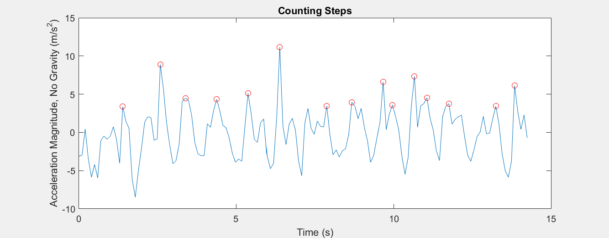

<h1>iOS Sensor interface - Accelerator </h1>
These projects uses the accelerometer of the iPhone.  
All testing was done with iPhone 6.  

<b>References:</b> 
- <a href="https://en.wikipedia.org/wiki/Accelerometer">Wikipedia</a> 
- <a href="http://se.mathworks.com/help/supportpkg/iossensor/ug/acquire-sensor-data.html#buy0l93">Matlab docs</a> 
- <a href="http://stackoverflow.com/questions/2122333/how-to-count-the-number-of-steps-using-the-accelerometer">Stackoverflow</a> 
- <a href="https://www.nxp.com/files/sensors/doc/app_note/AN3397.pdf">NXP Semiconductors</a>
  

<b>Graph of step counter script</b>
</img>
This is the first script, it's not very accurate at the moment.

